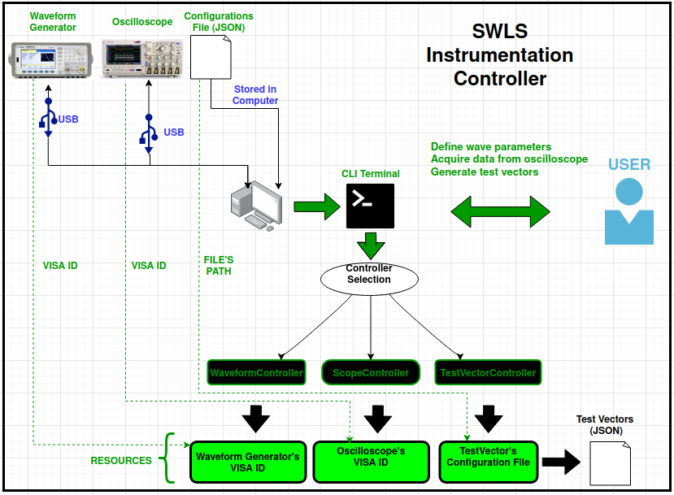

# Programmable-Environment for Reliable Instrumentation CLI System (PeriCLIs)

## Brief Description

Command Line Interface (CLI) for controlling and reading electrical signals, accessible via the OS terminal. It reads data from oscilloscopes (continuously or post-trigger), adjusts waveform generator's voltages and also controls their parameters. This is done using the **VISA** communication protocol, which connects to compatible devices via their **VISA ID**. The CLI also generates testvectors with entirely customizable settings and parameters, making it ideal for FPGA system testing.

- 

## Index

- [Requirements](#requirements)
- [Connecting Devices](#connecting-devices)
- [Checking Devices' Models](#checking-devices'-models)
- [How to Access the CLI](#how-to-access-the-cli)
- [Initial Commands](#initial-commands)
- [Controllers](#controllers)
- [Resourcers](#resourcers)
- [Services](#services)
- [Waveform Control](#waveform-control)
- [Scope Control](#scope-control)
- [Testvector](#testvector)

## Requirements

To add the CLI python required modules in your virtual environment, open the project's root directory in the terminal and use the following command:

```sh
pip install -r requirements.txt
```

## Which devices is the CLI compatible with?

This CLI enables control of waveform generators and oscilloscopes compatible with the **VISA** communication protocol.

Many devices on the market support **VISA**, making them compatible with this CLI.

To control devices, connect them to your computer's USB ports. The CLI supports the connection of multiple devices simultaneously.

Even without connecting any devices, you can still access the CLI and generate test vectors via the virtual resources, that can be added via the CLI or manually using any of the virtual resources json templates found in the folder **./test_vector_control/json_templates** and placing the custom json in the folder **./data/virtual_resources/**.

Other necessary configurations will be managed within the CLI and explained further.

## Checking Devices' Model

This CLI is tailored for controlling the **Keysight 33500B Waveform Generator** and the **Tektronix MSO2024 Oscilloscope**.

If these are your intended devices, no specific parameters or command syntax need to be specified, as they are already standardized.

See if other models' command syntax matches those in the **device_specific_commands.py** (**scope_control** or **waveform_control** folders).

To confirm the correct syntax for controlling an oscilloscope, search online about the **VISA** protocol or contact the manufacturer.

If the syntax differs from that in the **device_specific_commands.py files**, you'll need to edit these files accordingly and added your own custom controller, which you can fork add/modify following the structure given by the chosen base controller.

## How to Access the CLI?

To access the CLI, download this repository and install the requirements as explained in the final section. Also, it is necessary to add this project's root directory to the PYTHONPATH of your system.

Navigate to this project's root directory in your terminal then
run the Python script to start using the CLI:

```sh
python init.py
```
Once it is done, the CLI is ready for immediate use!

Another way to do this is by first installing new commands from the setup.py file (when on the PERICLIS-INSTRUMENT-CONTROL directory):
```sh
pip install .
```

After that you can also use the following command to access the CLI (it is analougous to the python init.py):
```sh
cli
```


## Initial Commands

After following the previous sections' instructions, you should already be in the CLI on your terminal.

Several initial commands are available, including:

- **alias**, args: alias controller_name resource_id (resource_id can be UPPER CASE)
- **alias_delete**, args: alias
- **alias_list**
- **connect_resource**, args: ResourceId ControllerName
- **delay**, args: delay_time (seconds)
- **disconnect**
- **find_resources**
- **list_commands**
- **present_controllers**
- **quit**
- **services_list**

It is importante to explain that the 'args' mentioned above are simply argumments that must be written after the coommand. It is also noteworth that **it is not needed to type all letters of the commands on the terminal. After the first letters, it is possible to use TAB for an automatic completion** of the command (when there is only one possible command with the typed letters). This is also true for the serices

The **alias** command allows you to create an alias. This alias will have the name of the argumment "alias" and will act on the  controller defined by the "controller_name" argument and on the ID defined by the "resource_id" command. The controller and the ID will be better explained below this topic. An example of the use of this command can be sse below:
```sh
alias alias_sample scope_controller USB0::1689::888::c010838::0::INSTR
```

This command create an alias with the "alias_sample" name associated with the "scope_controller" controller and with the
USB0::1689::888::c010838::0::INSTR ID. The same logic can be applied to use the other commands. 

The **alias_delete** command allows you delete a resource named "alias".

The **alias_list** shows a list with all alias, highlighting the controller and ID to which they are associated.

The **connect_resource** command allows to use a resource (defined by the resource argumment) to connect to a controller  (defined by the controller argumment)

The **delay** command waits for a time corresponding to the delay_time argumment in seconds.

The **disconnect** command disconnects the current controller and resource.

The **find_resources** command allows you to see all available resources (will be explained further in the Resources topic).

The **list_commands** command allows you to see all available commands.

The **present_controllers** commands allows you to see all controllers (will be explained further in the Controllers topic).

The **quit** command finishes executing the **init.py** script, returning to the **periclis_instrumentation_controller** directory.

The **services_list** command lists all services usable on the connected controller (will be explained further in the Services topic).


## Controllers

Controllers are simply sets of functionalities that you want your code to execute.

These functionalities can be:

- Control a waveform generator of electrical signals (**WaveformController**)
- Control an oscilloscope (**ScopeController**)
- Simulating voltage values and comparing them with predefined values to generate test vectors (**TestvectorController**).

In order to dynamically see all controllers available, you can use the command mentioned in the previous section:

```sh
list_controllers
```

This command will show a list containing the 3 controllers cited above:

```sh
ControllerID     ControllerName
        0       WaveformController
        1       ScopeController
        2       TestVectorController
```

Functionality of each of the above controllers' will be detailed in their directory's README.md files.

In order to access any of the controllers, you must also connect with a resource. To connect with both the controller and the resource, you can use the **connect_resource** command.

An example of this connection will be given below, to demonstrate the connecting to the **WaveformController** with the resource 0:

```sh
connect_resource 0 WaveformController
```

To connect with other controllers, such as the **ScopeController** or the TestvectorController, you can simply write their names (listed in the ControllerName row) in the command showed above, instead of **WaveformController**.

To switch to a different resource, input its corresponding number, instead of 0 (in the **connect_resource** command). Each resource is assigned a unique number (ResourceID), as detailed in the following section.

You can also substitue the ResourceID and the Controller Name for an pre-defined alias, using the command cited in the Initial Commands topic. 

If there is an alias named "waveform" associated with the WaveformController controller and with the ID corresponding to the device associated with the 0 ID, you can also connect to them with:
```sh
connect_resource waveform
```

## Resources

Resources are the devices or configuration settings that are going to be used in the controllers.

In order to use a controller, you'll need usually to inform which resource/device you want to control.

This information is provided by the **VISA ID**, unique to each equipment compatible with the **VISA** communication protocol.

When the controller is connected to the TestVectorController, there are many configurations to be set.

These configurations are defined into files (formats such as .json) that act as resources. Therefore, in order to generate the test vectors, you also need to inform the resource files containing the configurations.

A list containing all existing resources, can be accessed with the following command:

```sh
list_resources
```

This command will print a list with all possible resources:

```sh
ResourceID   ResourceLabel
    0      USB0::1689::888::C010837::0::INSTR
    1      USB0::2391::9479::MY57100781::0::INSTR
    2    waveform_generators/basic_generator.json
```

In order to connect to a specific resource, you need to inform their ResourceID as shown in the table above, in **connect_resource** command, as explained in the previous section.

The resources above are dynamically actualized in the CLI, each time that a command related to them is used.

As explained, there are 2 types of resources:

- Resources of **VISA IDs**. These IDs correspond to all **VISA** devices connected to USB ports.
- Resources of configuration files that are going to be used to generate the test vectors (will be better explained in the README.md of Testvector repository).

## Services

After connecting to a controller with a defined resource, you will be able to use the specific services of the controller.Services are simply functionalities that can be used in a specific controller.

**All tasks executed by the CLI are services (including the ones with the waveform generator, oscilloscope, and the generation of test vector).** Hence, you will need to use them to perform your desired activities.

In order to check all the services of a specific controller, you must first connect to the controller with the **connect_resource** command explained above and then use the command:

```sh
list_services
```

This will return a list with all commands available for that controller. If you connect to the **WaveformController**, the CLI will return the following list with its services:

```sh
    - query_info
    - read_all
    - read_voltage
    - read_frequency
    - read_offset
    - read_phase
    - read_function_type
    - change_voltage
    - change_frequency_hz
    - change_offset
    - change_phase
    - change_function_type
```

**All services of all controllers have their functionality explained in the README.md files of each controller directory. Check these files, to understand what exactly each service can do.**

Then, you can choose the service of interest and type the command in the CLI in order to access its functionality.

For instance, the **WaveformController** has a service called **read_type_frequency_amplitude_offset**  which reads several parameters of the waveform generator.

You can type it in the CLI (after connected to the **WaveformController** with the **connect_resource** command as explained before) in order to access the service functionality, as shown below:

```sh
read_type_frequency_amplitude_offset
```

This service prints the following line in terminal:

```sh
"SIN +1.000E+03,+2.000E+00,+1.000E+00"
```

These data correspond to the following parameters of the waveform generator: wave format (SIN = sinusoid), frequency (1.000E+03 = 1000 Hz), amplitude (2.000E+00 = 2 V), offset (1.000E+00 = 2 V).

Another example can be given by the service **change_voltage** (also, of the **WaveformController**). This command changes the generator's voltage value to the number written after it (in Volts). An example is shown below:

```sh
change_voltage 3.0
```

The command above changes the waveform generator's voltage to 3.0 V.

It is important to reaffirm that each service is described in the README.md files of their respective directories, and **these descriptions include instructions as to when it is necessary to add variables after the commands.**

## Executing Scripts

You can also these services to generates scripts of them. This can be done by modifying or creating txt scripts on the scripts folder. For instance, to edit or create a new script called test.txt (when on the PERICLIS-INSTRUMENT-CONTROL directory), it is needed to be typed on terminal:

```sh
nano scripts/test.txt
```
Then on the script, you can save a sequence of commands and services to be executed in sequence. An example is given below:

connect_resource wave
change_output_on
change_amplitude 2
connect_resource scope
monitore_dc_voltage
delay 5
disconnect
connect_resource wave
change_amplitude 3
connect_resource scope
use_trigger_mode

This way, you can execute all these commands in sequence by typing: 

```sh
python init.py < ./scripts/test.txt
```


Agora, será enviada a função final, veja se consegue entender as mudanças que fiz para que os próximos trechos sejam enviados, conforme essa versão final: - Requisitos
- Conectando Dispositivos
- Verificando Modelos de Dispositivos
- Acesso a CLI
- Comandos Iniciais
- Controladores
- Recursos
- Serviços
- Controle de Formas de Onda
- Controle de Osciloscópio
- Testvector

Requisitos

Para adicionar os módulos Python necessários da CLI no seu ambiente virtual, abra o diretório raiz do projeto no terminal e utilize o seguinte comando:

pip install -r requirements.txt

 Conectando Dispositivo

Esta CLI permite o controle de geradores de formas de onda e osciloscópios compatíveis com o protocolo de comunicação VISA. Muitos dispositivos no mercado suportam VISA, tornando-os compatíveis com esta CLI.  Para controlar os dispositivos, conecte-os às portas USB do seu computador. A CLI suporta a conexão de múltiplos dispositivos simultaneamente.

Mesmo sem conectar dispositivos, é possível ainda acessar a CLI e gerar vetores de teste através dos recursos virtuais, que podem ser adicionados via CLI ou manualmente utilizando qualquer um dos modelos de recursos virtuais em JSON encontrados na pasta ./test_vector_control/json_templates, colocando o JSON personalizado na pasta ./data/virtual_resources/.

Outras configurações necessárias serão gerenciadas dentro da CLI e explicadas mais adiante.


Verificando Modelos de Dispositivos
Esta CLI é projetada para controlar o Gerador de Formas de Onda Keysight 33500B e o Osciloscópio Tektronix MSO2024. Se estes são os seus dispositivos pretendidos, não é necessário especificar parâmetros específicos ou sintaxe de comando, pois eles já estão padronizados.

Verifique se a sintaxe de comando de outros modelos corresponde àquelas nos arquivos device_specific_commands.py (pastas scope_control ou waveform_control). Para confirmar a sintaxe correta para controlar um osciloscópio, pesquise online sobre o protocolo VISA ou entre em contato com o fabricante. Se a sintaxe diferir daquela nos arquivos device_specific_commands.py, será preciso editar esses arquivos conforme necessário e adicionar seu próprio controlador personalizado, que pode ser bifurcado e modificado seguindo a estrutura fornecida pelo controlador base escolhido.


Acesso a CLI
Para acessar a CLI, baixe este repositório e instale os requisitos conforme explicado na seção final. Além disso, é necessário adicionar o diretório raiz deste projeto ao PYTHONPATH do seu sistema.

Navegue até o diretório raiz deste projeto no seu terminal e então execute o script Python para começar a usar a CLI:

python init.py

Após concluído, a CLI estará pronta para uso imediato! Outra forma de fazer isso é instalando novos comandos do arquivo setup.py (quando no diretório PERICLIS-INSTRUMENT-CONTROL):

pip install .

Após isso, é possível também pode usar o seguinte comando para acessar a CLI (é análogo ao python init.py):

cli


 Comandos Iniciais
Após seguir as instruções das seções anteriores, já se estará na CLI no seu terminal. Vários comandos iniciais estão disponíveis, incluindo:

alias, args: alias controller_name resource_id (resource_id pode ser maiusculo)
alias_delete, args: alias
alias_list
connect_resource, args: ResourceId ControllerName
delay, args: delay_time (segundos)
disconnect
find_resources
list_commands
present_controllers
quit
services_list

É importante explicar que os 'args' mencionados acima são simplesmente argumentos que devem ser escritos após esses comandos. Também é importante notar que não é necessário digitar todas as letras dos comandos no terminal. Após as primeiras letras, é possível usar a tecla TAB para completar automaticamente o comando (quando houver apenas um comando possível com as letras digitadas). Isso também é válido para os serviços.

O comando alias permite criar um alias (“apelido”. Esse alias será usado para denota um ID e um controlador (sobre os quais serão explicados no futuro). O “apelido” terá o nome do argumento "alias" e atuará no controlador definido pelo argumento "controller_name" e no ID definido pelo comando "resource_id". Um exemplo do uso deste comando pode ser visto abaixo:

alias alias_sample scope_controller USB0::1689::888::c010838::0::INSTR

Este comando cria um alias com o nome " alias_sample" associado ao controlador " scope_controller" e ao ID "USB0::1689::888::c010838::0::INSTR". A mesma lógica pode ser aplicada para usar os outros comandos.

- O comando alias_delete permite excluir um recurso chamado "alias".

- O comando alias_list mostra uma lista com todos os alias, destacando o controlador e o ID aos quais estão associados.

- O comando connect_resource permite usar um recurso (definido pelo argumento resource) para se conectar a um controlador (definido pelo argumento controller).

- O comando delay espera pelo tempo correspondente ao argumento delay_time em segundos.

- O comando disconnect desconecta o controlador e o recurso atuais.

- O comando find_resources permite ver todos os recursos disponíveis (será explicado mais detalhadamente no tópico Recursos).

- O comando list_commands permite ver todos os comandos disponíveis.

- O comando present_controllers permite ver todos os controladores (será explicado mais detalhadamente no tópico Controladores).

- O comando quit finaliza a execução do script init.py, retornando ao diretório periclis_instrumentation_controller.

- O comando services_list lista todos os serviços utilizáveis no controlador conectado (será explicado mais detalhadamente no tópico Serviços).


Controladores
Controladores são simplesmente conjuntos de funcionalidades que se deseja que sejam executadas pelo código. Essas funcionalidades podem ser:

- Controlar um gerador de formas de onda de sinais elétricos (WaveformController)
- Controlar um osciloscópio (ScopeController)
- Simular valores de voltagem e compará-los com valores pré-definidos para gerar vetores de teste (TestvectorController).

Para ver dinamicamente todos os controladores disponíveis, é possível usar o comando mencionado na seção anterior:

list_controllers

Este comando mostrará uma lista contendo os 3 controladores citados acima:

ID do Controlador             Nome do Controlador
0                                         WaveformController
1                                              ScopeController
2                                          TestVectorController

A funcionalidade de cada um dos controladores acima será detalhada nas próximas seções. Para acessar qualquer um dos controladores, é possível também se conectar a um recurso. Para conectar tanto o controlador quanto o recurso, é possível usar o comando connect_resource.
Um exemplo desta conexão será dado abaixo, para demonstrar a conexão com o WaveformController com o recurso 0:

connect_resource 0 WaveformController

Para conectar-se a outros controladores, como o ScopeController ou o TestvectorController, basta escrever seus nomes (listados na linha Nome do Controlador) no comando mostrado acima, em vez de WaveformController.

Para alternar para um recurso diferente, insira o número correspondente, em vez de 0 (no comando connect_resource). Cada recurso é atribuído a um número único (ResourceID), conforme detalhado na seção seguinte. Pode também substituir o ResourceID e o Nome do Controlador por um alias pré-definido, usando o comando citado no tópico Comandos Iniciais.

Se houver um alias chamado "waveform" associado ao controlador WaveformController e com o ID correspondente ao dispositivo associado ao ID 0, é possível também conectá-los com:

connect_resource waveform

Recursos
Recursos são os dispositivos ou configurações que serão usados nos controladores. Para usar um controlador, geralmente é necessário informar qual recurso/dispositivo se deseja controlar. Essa informação é fornecida pelo ID VISA, único para cada equipamento compatível com o protocolo de comunicação VISA.
Quando o controlador está conectado Para o Controlador de Teste, há muitas configurações a serem ajustadas. Essas configurações estão definidas em arquivos (formatos como .json) que funcionam como recursos. Portanto, para gerar os vetores de teste, será preciso também informar os arquivos de recursos que contêm as configurações.
Uma lista contendo todos os recursos existentes pode ser acessada com o seguinte comando:
list_resources
Este comando imprimirá uma lista com todos os recursos possíveis:
ResourceID   ResourceLabel
    0      USB0::1689::888::C010837::0::INSTR
    1      USB0::2391::9479::MY57100781::0::INSTR
    2    waveform_generators/basic_generator.json
Para se conectar a um recurso específico, é preciso informar seu ResourceID conforme mostrado na tabela acima, no comando connect_resource, conforme explicado na seção anterior. Os recursos acima são dinamicamente atualizados no CLI cada vez que um comando relacionado a eles é utilizado. Como explicado, existem 2 tipos de recursos:
Recursos de IDs VISA. Esses IDs correspondem a todos os dispositivos VISA conectados às portas USB.
Recursos de arquivos de configuração que serão usados para gerar os vetores de teste (serão melhor explicados no README.md do repositório Testvector).

Serviços
Após se conectar a um controlador com um recurso definido, é possível usar os serviços específicos do controlador. Serviços são simplesmente funcionalidades que podem ser usadas em um controlador específico.
Todas as tarefas executadas pelo CLI são serviços (incluindo aquelas com o gerador de forma de onda, osciloscópio e geração de vetor de teste). Portanto, será preciso usá-los para realizar suas atividades desejadas. Para verificar todos os serviços de um controlador específico, deve-se primeiro  conectar ao controlador com o comando connect_resource explicado acima e depois usar o comando:
list_services
Isso retornará uma lista com todos os comandos disponíveis para aquele controlador. Se você se conectar ao WaveformController, o CLI retornará a seguinte lista com seus serviços:
query_info
read_all
read_voltage
read_frequency
read_offset
read_phase
read_function_type
change_voltage
change_frequency_hz
change_offset
change_phase
change_function_type
Todos os serviços de todos os controladores têm sua funcionalidade explicada nos arquivos README.md de cada pasta dos controladores e serão melhores detalhados nas próximas seções. Verifique esses arquivos para entender exatamente o que cada serviço pode fazer.
Em seguida, é possível escolher o serviço de interesse e digitar o comando no CLI para acessar sua funcionalidade. Por exemplo, o WaveformController tem um serviço chamado read_type_frequency_amplitude_offset que lê vários parâmetros do gerador de forma de onda.
É possível digitá-lo no CLI (após se conectar ao WaveformController com o comando connect_resource conforme explicado antes) para acessar a funcionalidade do serviço, conforme mostrado abaixo:
read_type_frequency_amplitude_offset
Este serviço imprime a seguinte linha no terminal:
SIN +1.000E+03,+2.000E+00,+1.000E+00
Esses dados correspondem aos seguintes parâmetros do gerador de forma de onda: formato da onda (SIN = senoide), frequência (1.000E+03 = 1000 Hz), amplitude (2.000E+00 = 2 V), offset (1.000E+00 = 1 V).

Outro exemplo pode ser dado pelo serviço change_voltage (também do WaveformController). Este comando altera o valor de voltagem do gerador para o número escrito após ele (em volts). Um exemplo é mostrado abaixo:
change_voltage 3.0
O comando acima altera a voltagem do gerador de forma de onda para 3.0 V.
É importante reafirmar que cada serviço é descrito nos arquivos README.md de seus respectivos diretórios, e essas descrições incluem instruções sobre quando é necessário adicionar variáveis após os comandos. Serão melhores detalhadas nas próximas seções deste capítulo.

Executando Scripts
É possível também usar esses serviços para gerar scripts com eles. Isso pode ser feito modificando ou criando scripts .txt na pasta de scripts. Por exemplo, para editar ou criar um novo script chamado test.txt (no diretório PERICLIS-INSTRUMENT-CONTROL), é necessário digitar no terminal:
nano scripts/test.txt
Em seguida, no script, é possível salvar uma sequência de comandos e serviços para serem executados em sequência. Um exemplo é dado abaixo:
connect_resource wave
change_output_on
change_amplitude 2
connect_resource scope
monitore_dc_voltage
delay 5
disconnect
connect_resource wave
change_amplitude 3
connect_resource scope
use_trigger_mode
Dessa forma, é possível pode executar todos esses comandos em sequência digitando:
python init.py < ./scripts/test.txt